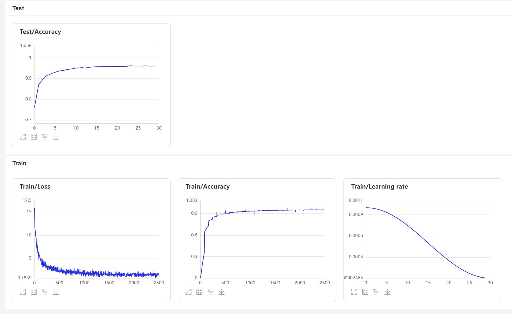

# 前言
此版本为新版本，相比上一个版本，最大的变化是此版本支持pip安装，以及把预处理使用模型算子实现，这样做的好处就是可以直接使用GPU计算，大幅度提高了预处理的速度，估计预处理速度可在10~20倍。

如想使用使用旧版本，请转到[release/1.0](https://github.com/yeyupiaoling/VoiceprintRecognition_Pytorch/tree/release/1.0)，本项目使用了EcapaTdnn模型实现的声纹识别，不排除以后会支持更多模型，同时本项目也支持了多种数据预处理方法，损失函数参考了人脸识别项目的做法[PaddlePaddle-MobileFaceNets](https://github.com/yeyupiaoling/PaddlePaddle-MobileFaceNets) ,使用了ArcFace Loss，ArcFace loss：Additive Angular Margin Loss（加性角度间隔损失函数），对特征向量和权重归一化，对θ加上角度间隔m，角度间隔比余弦间隔在对角度的影响更加直接。


**欢迎大家扫码入QQ群讨论**，或者直接搜索QQ群号`1169600237`，问题答案为博主Github的ID`yeyupiaoling`。

<div align="center">
  
</div>


使用环境：

 - Anaconda 3
 - Python 3.8
 - Pytorch 1.12.1
 - Windows 10 or Ubuntu 18.04

# 项目特性

1. 支持模型：EcapaTdnn、TDNN、Res2Net、ResNetSE
2. 支持池化层：AttentiveStatsPool(ASP)、SelfAttentivePooling(SAP)、TemporalStatisticsPooling(TSP)、TemporalAveragePooling(TAP)
3. 支持损失函数：AAMLoss、AMLoss、ARMLoss、CELoss
4. 支持预处理方法：MelSpectrogram、Spectrogram、MFCC

# 模型下载

<table align="center">
<tr>
  <th align="center">模型</th>
  <th align="center">预处理方法</th>
  <th align="center">数据集</th>
  <th align="center">类别数量</th>
  <th align="center">tpr</th>
  <th align="center">fpr</th>
  <th align="center">eer</th>
  <th align="center">模型下载地址</th>
</tr>
<tr>
  <td align="center">EcapaTdnn</td>
  <td align="center">MelSpectrogram</td>
  <td align="center"><a href="https://github.com/fighting41love/zhvoice">中文语音语料数据集</a></td>
  <td align="center">3242</td>
  <td align="center">0.99092</td>
  <td align="center">0.00892</td>
  <td align="center">0.01800</td>
  <td align="center"><a href="https://download.csdn.net/download/qq_33200967/87153070">点击下载</a></td>
</tr>
<tr>
  <td align="center">EcapaTdnn</td>
  <td align="center">Spectrogram</td>
  <td align="center"><a href="https://github.com/fighting41love/zhvoice">中文语音语料数据集</a></td>
  <td align="center">3242</td>
  <td align="center">0.98793</td>
  <td align="center">0.00630</td>
  <td align="center">0.01837</td>
  <td align="center"><a href="https://download.csdn.net/download/qq_33200967/87015334">点击下载</a></td>
</tr>
<tr>
  <td align="center">EcapaTdnn</td>
  <td align="center">MFCC</td>
  <td align="center"><a href="https://github.com/fighting41love/zhvoice">中文语音语料数据集</a></td>
  <td align="center">3242</td>
  <td align="center">0.99212</td>
  <td align="center">0.00460</td>
  <td align="center">0.01248</td>
  <td align="center"><a href="https://download.csdn.net/download/qq_33200967/87523304">点击下载</a></td>
</tr>
<tr>
  <td align="center">EcapaTdnn</td>
  <td align="center">MelSpectrogram</td>
  <td align="center">更大的数据集</td>
  <td align="center">6355</td>
  <td align="center">0.97881</td>
  <td align="center">0.00788</td>
  <td align="center">0.02907</td>
  <td align="center"><a href="https://download.csdn.net/download/qq_33200967/86987829">点击下载</a></td>
</tr>
<tr>
  <td align="center">EcapaTdnn</td>
  <td align="center">MelSpectrogram</td>
  <td align="center">超大的数据集</td>
  <td align="center">13718</td>
  <td align="center"></td>
  <td align="center"></td>
  <td align="center"></td>
  <td align="center">即将提供下载，着急可以使用旧分支<a href="https://github.com/yeyupiaoling/VoiceprintRecognition-PaddlePaddle/tree/release/1.0">release/1.0</a></td>
</tr>
</table>

## 安装环境

 - 首先安装的是Pytorch的GPU版本，如果已经安装过了，请跳过。
```shell
conda install pytorch==1.12.1 torchvision==0.13.1 torchaudio==0.12.1 cudatoolkit=10.2 -c pytorch
```

 - 安装ppvector库。
 
使用pip安装，命令如下：
```shell
python -m pip install mvector -U -i https://pypi.tuna.tsinghua.edu.cn/simple
```

**建议源码安装**，源码安装能保证使用最新代码。
```shell
git clone https://github.com/yeyupiaoling/VoiceprintRecognition_Pytorch.git
cd VoiceprintRecognition_Pytorch/
python setup.py install
```

# 创建数据
本教程笔者使用的是[中文语音语料数据集](https://github.com/fighting41love/zhvoice) ，这个数据集一共有3242个人的语音数据，有1130000+条语音数据，下载之前要**全部解压**数据集。如果读者有其他更好的数据集，可以混合在一起使用，但最好是要用python的工具模块aukit处理音频，降噪和去除静音。

首先是创建一个数据列表，数据列表的格式为`<语音文件路径\t语音分类标签>`，创建这个列表主要是方便之后的读取，也是方便读取使用其他的语音数据集，语音分类标签是指说话人的唯一ID，不同的语音数据集，可以通过编写对应的生成数据列表的函数，把这些数据集都写在同一个数据列表中。

在`create_data.py`写下以下代码，因为[中文语音语料数据集](https://github.com/fighting41love/zhvoice) 这个数据集是mp3格式的，作者发现这种格式读取速度很慢，所以笔者把全部的mp3格式的音频转换为wav格式，这个过程可能很久。当然也可以不转换，项目也是支持的MP3格式的，只要设置参数`to_wav=False`。执行下面程序完成数据准备。
```shell
python create_data.py
```

执行上面的程序之后，会生成以下的数据格式，如果要自定义数据，参考如下数据列表，前面是音频的相对路径，后面的是该音频对应的说话人的标签，就跟分类一样。**自定义数据集的注意**，测试数据列表的ID可以不用跟训练的ID一样，也就是说测试的数据的说话人可以不用出现在训练集，只要保证测试数据列表中同一个人相同的ID即可。
```
dataset/zhvoice/zhmagicdata/5_895/5_895_20170614203758.wav	3238
dataset/zhvoice/zhmagicdata/5_895/5_895_20170614214007.wav	3238
dataset/zhvoice/zhmagicdata/5_941/5_941_20170613151344.wav	3239
dataset/zhvoice/zhmagicdata/5_941/5_941_20170614221329.wav	3239
dataset/zhvoice/zhmagicdata/5_941/5_941_20170616153308.wav	3239
dataset/zhvoice/zhmagicdata/5_968/5_968_20170614162657.wav	3240
dataset/zhvoice/zhmagicdata/5_968/5_968_20170622194003.wav	3240
dataset/zhvoice/zhmagicdata/5_968/5_968_20170707200554.wav	3240
dataset/zhvoice/zhmagicdata/5_970/5_970_20170616000122.wav	3241
```

# 训练模型
使用`train.py`训练模型，本项目支持多个音频预处理方式，通过`configs/ecapa_tdnn.yml`配置文件的参数`preprocess_conf.feature_method`可以指定，`MelSpectrogram`为梅尔频谱，`Spectrogram`为语谱图，`MFCC`梅尔频谱倒谱系数。通过参数`augment_conf_path`可以指定数据增强方式。训练过程中，会使用VisualDL保存训练日志，通过启动VisualDL可以随时查看训练结果，启动命令`visualdl --logdir=log --host 0.0.0.0`
```shell
# 单卡训练
CUDA_VISIBLE_DEVICES=0 python train.py
# 多卡训练
CUDA_VISIBLE_DEVICES=0,1 torchrun --standalone --nnodes=1 --nproc_per_node=2 train.py
```

训练输出日志：
```
[2023-02-25 11:53:53.194706 INFO   ] utils:print_arguments:13 - ----------- 额外配置参数 -----------
[2023-02-25 11:53:53.194706 INFO   ] utils:print_arguments:15 - augment_conf_path: configs/augmentation.json
[2023-02-25 11:53:53.194706 INFO   ] utils:print_arguments:15 - configs: configs/ecapa_tdnn.yml
[2023-02-25 11:53:53.194706 INFO   ] utils:print_arguments:15 - pretrained_model: None
[2023-02-25 11:53:53.194706 INFO   ] utils:print_arguments:15 - resume_model: None
[2023-02-25 11:53:53.194706 INFO   ] utils:print_arguments:15 - save_model_path: models/
[2023-02-25 11:53:53.194706 INFO   ] utils:print_arguments:15 - use_gpu: True
[2023-02-25 11:53:53.194706 INFO   ] utils:print_arguments:16 - ------------------------------------------------
[2023-02-25 11:53:53.208669 INFO   ] utils:print_arguments:18 - ----------- 配置文件参数 -----------
[2023-02-25 11:53:53.208669 INFO   ] utils:print_arguments:21 - dataset_conf:
[2023-02-25 11:53:53.208669 INFO   ] utils:print_arguments:28 - 	batch_size: 64
[2023-02-25 11:53:53.208669 INFO   ] utils:print_arguments:28 - 	chunk_duration: 3
[2023-02-25 11:53:53.208669 INFO   ] utils:print_arguments:28 - 	do_vad: False
[2023-02-25 11:53:53.209670 INFO   ] utils:print_arguments:28 - 	min_duration: 0.5
[2023-02-25 11:53:53.209670 INFO   ] utils:print_arguments:28 - 	num_speakers: 3242
[2023-02-25 11:53:53.209670 INFO   ] utils:print_arguments:28 - 	num_workers: 4
[2023-02-25 11:53:53.209670 INFO   ] utils:print_arguments:28 - 	sample_rate: 16000
[2023-02-25 11:53:53.209670 INFO   ] utils:print_arguments:28 - 	target_dB: -20
[2023-02-25 11:53:53.209670 INFO   ] utils:print_arguments:28 - 	test_list: dataset/test_list.txt
[2023-02-25 11:53:53.209670 INFO   ] utils:print_arguments:28 - 	train_list: dataset/train_list.txt
[2023-02-25 11:53:53.209670 INFO   ] utils:print_arguments:28 - 	use_dB_normalization: True
[2023-02-25 11:53:53.209670 INFO   ] utils:print_arguments:21 - feature_conf:
[2023-02-25 11:53:53.209670 INFO   ] utils:print_arguments:28 - 	hop_length: 160
[2023-02-25 11:53:53.209670 INFO   ] utils:print_arguments:28 - 	n_fft: 400
[2023-02-25 11:53:53.209670 INFO   ] utils:print_arguments:28 - 	n_mels: 80
[2023-02-25 11:53:53.209670 INFO   ] utils:print_arguments:28 - 	sr: 16000
[2023-02-25 11:53:53.209670 INFO   ] utils:print_arguments:28 - 	win_length: 400
[2023-02-25 11:53:53.209670 INFO   ] utils:print_arguments:28 - 	window: hann
[2023-02-25 11:53:53.209670 INFO   ] utils:print_arguments:21 - model_conf:
[2023-02-25 11:53:53.209670 INFO   ] utils:print_arguments:28 - 	channels: [512, 512, 512, 512, 1536]
[2023-02-25 11:53:53.209670 INFO   ] utils:print_arguments:28 - 	dilations: [1, 2, 3, 4, 1]
[2023-02-25 11:53:53.209670 INFO   ] utils:print_arguments:28 - 	kernel_sizes: [5, 3, 3, 3, 1]
[2023-02-25 11:53:53.210667 INFO   ] utils:print_arguments:28 - 	lin_neurons: 192
[2023-02-25 11:53:53.210667 INFO   ] utils:print_arguments:21 - optimizer_conf:
[2023-02-25 11:53:53.210667 INFO   ] utils:print_arguments:28 - 	learning_rate: 0.001
[2023-02-25 11:53:53.210667 INFO   ] utils:print_arguments:28 - 	weight_decay: 1e-6
[2023-02-25 11:53:53.220680 INFO   ] utils:print_arguments:21 - preprocess_conf:
[2023-02-25 11:53:53.220680 INFO   ] utils:print_arguments:28 - 	feature_method: MelSpectrogram
[2023-02-25 11:53:53.220680 INFO   ] utils:print_arguments:21 - train_conf:
[2023-02-25 11:53:53.220680 INFO   ] utils:print_arguments:28 - 	log_interval: 100
[2023-02-25 11:53:53.220680 INFO   ] utils:print_arguments:28 - 	max_epoch: 30
[2023-02-25 11:53:53.220680 INFO   ] utils:print_arguments:30 - use_model: ecapa_tdnn
[2023-02-25 11:53:53.220680 INFO   ] utils:print_arguments:31 - ------------------------------------------------
[2022-11-05 19:58:31.589525 INFO   ] augmentation:_parse_pipeline_from:126 - 数据增强配置：{'type': 'noise', 'aug_type': 'audio', 'params': {'min_snr_dB': 10, 'max_snr_dB': 50, 'repetition': 2, 'noise_dir': 'dataset/noise/'}, 'prob': 0.0}
[2022-11-05 19:58:31.589525 INFO   ] augmentation:_parse_pipeline_from:126 - 数据增强配置：{'type': 'resample', 'aug_type': 'audio', 'params': {'new_sample_rate': [8000, 32000, 44100, 48000]}, 'prob': 0.0}
[2022-11-05 19:58:31.589525 INFO   ] augmentation:_parse_pipeline_from:126 - 数据增强配置：{'type': 'speed', 'aug_type': 'audio', 'params': {'min_speed_rate': 0.9, 'max_speed_rate': 1.1, 'num_rates': 3}, 'prob': 0.0}
[2022-11-05 19:58:31.589525 INFO   ] augmentation:_parse_pipeline_from:126 - 数据增强配置：{'type': 'shift', 'aug_type': 'audio', 'params': {'min_shift_ms': -5, 'max_shift_ms': 5}, 'prob': 0.0}
[2022-11-05 19:58:31.590535 INFO   ] augmentation:_parse_pipeline_from:126 - 数据增强配置：{'type': 'volume', 'aug_type': 'audio', 'params': {'min_gain_dBFS': -15, 'max_gain_dBFS': 15}, 'prob': 0.0}
[2022-11-05 19:58:31.590535 INFO   ] augmentation:_parse_pipeline_from:126 - 数据增强配置：{'type': 'specaug', 'aug_type': 'feature', 'params': {'inplace': True, 'max_time_warp': 5, 'max_t_ratio': 0.01, 'n_freq_masks': 2, 'max_f_ratio': 0.05, 'n_time_masks': 2, 'replace_with_zero': False}, 'prob': 0.0}
[2022-11-05 19:58:31.590535 INFO   ] augmentation:_parse_pipeline_from:126 - 数据增强配置：{'type': 'specsub', 'aug_type': 'feature', 'params': {'max_t': 10, 'num_t_sub': 2}, 'prob': 0.0}
I0424 08:57:03.707505  3377 nccl_context.cc:74] init nccl context nranks: 2 local rank: 0 gpu id: 0 ring id: 0
W0424 08:57:03.930370  3377 device_context.cc:447] Please NOTE: device: 0, GPU Compute Capability: 7.5, Driver API Version: 11.6, Runtime API Version: 10.2
W0424 08:57:03.932493  3377 device_context.cc:465] device: 0, cuDNN Version: 7.6.
I0424 08:57:05.431638  3377 nccl_context.cc:107] init nccl context nranks: 2 local rank: 0 gpu id: 0 ring id: 10
······
[2023-03-16 20:30:42.559858 INFO   ] trainer:__train_epoch:232 - Train epoch: [1/30], batch: [0/16579], loss: 16.48008, accuracy: 0.01562, learning rate: 0.00000000, speed: 21.27 data/sec, eta: 17 days, 7:38:55
[2023-03-16 20:31:15.045717 INFO   ] trainer:__train_epoch:232 - Train epoch: [1/30], batch: [100/16579], loss: 16.34529, accuracy: 0.00062, learning rate: 0.00000121, speed: 197.03 data/sec, eta: 1 day, 20:52:05
[2023-03-16 20:31:47.086451 INFO   ] trainer:__train_epoch:232 - Train epoch: [1/30], batch: [200/16579], loss: 16.31631, accuracy: 0.00054, learning rate: 0.00000241, speed: 199.77 data/sec, eta: 1 day, 20:14:40
[2023-03-16 20:32:19.711337 INFO   ] trainer:__train_epoch:232 - Train epoch: [1/30], batch: [300/16579], loss: 16.30544, accuracy: 0.00047, learning rate: 0.00000362, speed: 196.19 data/sec, eta: 1 day, 21:02:28
[2023-03-16 20:32:52.853642 INFO   ] trainer:__train_epoch:232 - Train epoch: [1/30], batch: [400/16579], loss: 16.29228, accuracy: 0.00043, learning rate: 0.00000483, speed: 193.14 data/sec, eta: 1 day, 21:44:42
[2023-03-16 20:33:25.116274 INFO   ] trainer:__train_epoch:232 - Train epoch: [1/30], batch: [500/16579], loss: 16.27346, accuracy: 0.00041, learning rate: 0.00000603, speed: 198.40 data/sec, eta: 1 day, 20:31:18
······
[2023-03-16 20:34:09.633572 INFO   ] trainer:train:304 - ======================================================================
100%|███████████████████████████████████| 84/84 [00:10<00:00,  7.79it/s]
开始两两对比音频特征...
100%|██████████████████████████████| 5332/5332 [00:07<00:00, 749.89it/s]
[2023-03-16 20:34:29.328638 INFO   ] trainer:train:306 - Test epoch: 1, time/epoch: 0:00:48.881889, threshold: 0.72, tpr: 0.62350, fpr: 0.04601, eer: 0.42250
[2023-03-16 20:34:29.328840 INFO   ] trainer:train:309 - ======================================================================
[2023-03-16 20:34:29.728986 INFO   ] trainer:__save_checkpoint:203 - 已保存模型：models/ecapa_tdnn_MelSpectrogram/best_model
[2023-03-16 20:34:30.724868 INFO   ] trainer:__save_checkpoint:203 - 已保存模型：models/ecapa_tdnn_MelSpectrogram/epoch_1
[2023-03-16 20:30:42.559858 INFO   ] trainer:__train_epoch:232 - Train epoch: [2/30], batch: [0/16579], loss: 16.48008, accuracy: 0.01562, learning rate: 0.00000000, speed: 21.27 data/sec, eta: 17 days, 7:38:55
[2023-03-16 20:31:15.045717 INFO   ] trainer:__train_epoch:232 - Train epoch: [2/30], batch: [100/16579], loss: 16.34529, accuracy: 0.00062, learning rate: 0.00000121, speed: 197.03 data/sec, eta: 1 day, 20:52:05
[2023-03-16 20:31:47.086451 INFO   ] trainer:__train_epoch:232 - Train epoch: [2/30], batch: [200/16579], loss: 16.31631, accuracy: 0.00054, learning rate: 0.00000241, speed: 199.77 data/sec, eta: 1 day, 20:14:40
[2023-03-16 20:32:19.711337 INFO   ] trainer:__train_epoch:232 - Train epoch: [2/30], batch: [300/16579], loss: 16.30544, accuracy: 0.00047, learning rate: 0.00000362, speed: 196.19 data/sec, eta: 1 day, 21:02:28
······
```

VisualDL页面：



# 数据增强
本项目提供了几种音频增强操作，分布是随机裁剪，添加背景噪声，调节语速，调节音量，和SpecAugment。其中后面4种增加的参数可以在`configs/augmentation.json`修改，参数`prob`是指定该增强操作的概率，如果不想使用该增强方式，可以设置为0。要主要的是，添加背景噪声需要把多个噪声音频文件存放在`dataset/noise`，否则会跳过噪声增强
```yaml
noise:
  min_snr_dB: 10
  max_snr_dB: 30
  noise_path: "dataset/noise"
  prob: 0.5
```


# 评估模型
训练结束之后会保存预测模型，我们用预测模型来预测测试集中的音频特征，然后使用音频特征进行两两对比，计算tpr、fpr、eer。
```shell
python eval.py
```

输出类似如下：
```
······
------------------------------------------------
W0425 08:27:32.057426 17654 device_context.cc:447] Please NOTE: device: 0, GPU Compute Capability: 7.5, Driver API Version: 11.6, Runtime API Version: 10.2
W0425 08:27:32.065165 17654 device_context.cc:465] device: 0, cuDNN Version: 7.6.
[2023-03-16 20:20:47.195908 INFO   ] trainer:evaluate:341 - 成功加载模型：models/ecapa_tdnn_MelSpectrogram/best_model/model.pdparams
100%|███████████████████████████| 84/84 [00:28<00:00,  2.95it/s]
开始两两对比音频特征...
100%|███████████████████████████| 5332/5332 [00:05<00:00, 1027.83it/s]
评估消耗时间：65s，threshold：0.26，tpr：0.99391, fpr: 0.00611, eer: 0.01220
```

# 声纹对比
下面开始实现声纹对比，创建`infer_contrast.py`程序，编写`infer()`函数，在编写模型的时候，模型是有两个输出的，第一个是模型的分类输出，第二个是音频特征输出。所以在这里要输出的是音频的特征值，有了音频的特征值就可以做声纹识别了。我们输入两个语音，通过预测函数获取他们的特征数据，使用这个特征数据可以求他们的对角余弦值，得到的结果可以作为他们相识度。对于这个相识度的阈值`threshold`，读者可以根据自己项目的准确度要求进行修改。
```shell
python infer_contrast.py --audio_path1=audio/a_1.wav --audio_path2=audio/b_2.wav
```

输出类似如下：
```
-----------  Configuration Arguments -----------
audio_path1: audio/a_1.wav
audio_path2: audio/b_2.wav
feature_method: melspectrogram
resume: models/
threshold: 0.5
use_model: ecapa_tdnn
------------------------------------------------
W0425 08:29:10.006249 21121 device_context.cc:447] Please NOTE: device: 0, GPU Compute Capability: 7.5, Driver API Version: 11.6, Runtime API Version: 10.2
W0425 08:29:10.008555 21121 device_context.cc:465] device: 0, cuDNN Version: 7.6.
成功加载模型参数和优化方法参数：models/ecapa_tdnn/model.pdparams
audio/a_1.wav 和 audio/b_2.wav 不是同一个人，相似度为：-0.09565544128417969
```

# 声纹识别
在上面的声纹对比的基础上，我们创建`infer_recognition.py`实现声纹识别。同样是使用上面声纹对比的`infer()`预测函数，通过这两个同样获取语音的特征数据。 不同的是笔者增加了`load_audio_db()`和`register()`，以及`recognition()`，第一个函数是加载声纹库中的语音数据，这些音频就是相当于已经注册的用户，他们注册的语音数据会存放在这里，如果有用户需要通过声纹登录，就需要拿到用户的语音和语音库中的语音进行声纹对比，如果对比成功，那就相当于登录成功并且获取用户注册时的信息数据。第二个函数`register()`其实就是把录音保存在声纹库中，同时获取该音频的特征添加到待对比的数据特征中。最后`recognition()`函数中，这个函数就是将输入的语音和语音库中的语音一一对比。
有了上面的声纹识别的函数，读者可以根据自己项目的需求完成声纹识别的方式，例如笔者下面提供的是通过录音来完成声纹识别。首先必须要加载语音库中的语音，语音库文件夹为`audio_db`，然后用户回车后录音3秒钟，然后程序会自动录音，并使用录音到的音频进行声纹识别，去匹配语音库中的语音，获取用户的信息。通过这样方式，读者也可以修改成通过服务请求的方式完成声纹识别，例如提供一个API供APP调用，用户在APP上通过声纹登录时，把录音到的语音发送到后端完成声纹识别，再把结果返回给APP，前提是用户已经使用语音注册，并成功把语音数据存放在`audio_db`文件夹中。
```shell
python infer_recognition.py
```

输出类似如下：
```
-----------  Configuration Arguments -----------
audio_db: audio_db
feature_method: melspectrogram
resume: models/
threshold: 0.5
use_model: ecapa_tdnn
------------------------------------------------
W0425 08:30:13.257884 23889 device_context.cc:447] Please NOTE: device: 0, GPU Compute Capability: 7.5, Driver API Version: 11.6, Runtime API Version: 10.2
W0425 08:30:13.260191 23889 device_context.cc:465] device: 0, cuDNN Version: 7.6.
成功加载模型参数和优化方法参数：models/ecapa_tdnn/model.pdparams
Loaded 沙瑞金 audio.
Loaded 李达康 audio.
请选择功能，0为注册音频到声纹库，1为执行声纹识别：0
按下回车键开机录音，录音3秒中：
开始录音......
录音已结束!
请输入该音频用户的名称：夜雨飘零
请选择功能，0为注册音频到声纹库，1为执行声纹识别：1
按下回车键开机录音，录音3秒中：
开始录音......
录音已结束!
识别说话的为：夜雨飘零，相似度为：0.920434
```

# 其他版本
 - Tensorflow：[VoiceprintRecognition-Tensorflow](https://github.com/yeyupiaoling/VoiceprintRecognition-Tensorflow)
 - PaddlePaddle：[VoiceprintRecognition-PaddlePaddle](https://github.com/yeyupiaoling/VoiceprintRecognition-PaddlePaddle)
 - Keras：[VoiceprintRecognition-Keras](https://github.com/yeyupiaoling/VoiceprintRecognition-Keras)


# 参考资料
1. https://github.com/PaddlePaddle/PaddleSpeech
2. https://github.com/yeyupiaoling/PaddlePaddle-MobileFaceNets
3. https://github.com/yeyupiaoling/PPASR
