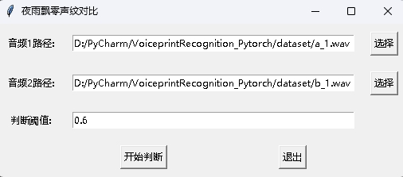
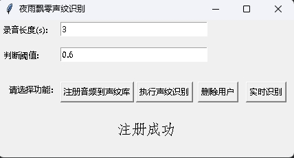

简体中文 | [English](./README_en.md)

# 基于Pytorch实现的声纹识别系统


本分支为1.0版本，如果要使用之前的0.3版本请在[0.x分支](https://github.com/yeyupiaoling/VoiceprintRecognition-Pytorch/tree/release/0.x)使用。本项目使用了EcapaTdnn、ResNetSE、ERes2Net、CAM++等多种先进的声纹识别模型，不排除以后会支持更多模型，同时本项目也支持了MelSpectrogram、Spectrogram、MFCC、Fbank等多种数据预处理方法，使用了ArcFace Loss，ArcFace loss：Additive Angular Margin Loss（加性角度间隔损失函数），对应项目中的AAMLoss，对特征向量和权重归一化，对θ加上角度间隔m，角度间隔比余弦间隔在对角度的影响更加直接，除此之外，还支持AMLoss、ARMLoss、CELoss等多种损失函数。

**欢迎大家扫码入知识星球或者QQ群讨论，知识星球里面提供项目的模型文件和博主其他相关项目的模型文件，也包括其他一些资源。**

<div align="center">
  
  
</div>

使用环境：

 - Anaconda 3
 - Python 3.11
 - Pytorch 2.0.1
 - Windows 10 or Ubuntu 18.04

# 项目特性

1. 支持模型：EcapaTdnn、TDNN、Res2Net、ResNetSE、ERes2Net、CAM++
2. 支持池化层：AttentiveStatsPool(ASP)、SelfAttentivePooling(SAP)、TemporalStatisticsPooling(TSP)、TemporalAveragePooling(TAP)、TemporalStatsPool(TSTP)
3. 支持损失函数：AAMLoss、SphereFace2、AMLoss、ARMLoss、CELoss
4. 支持预处理方法：MelSpectrogram、Spectrogram、MFCC、Fbank

**模型论文：**

- EcapaTdnn：[ECAPA-TDNN: Emphasized Channel Attention, Propagation and Aggregation in TDNN Based Speaker Verification](https://arxiv.org/abs/2005.07143v3)
- PANNS：[PANNs: Large-Scale Pretrained Audio Neural Networks for Audio Pattern Recognition](https://arxiv.org/abs/1912.10211v5)
- TDNN：[Prediction of speech intelligibility with DNN-based performance measures](https://arxiv.org/abs/2203.09148)
- Res2Net：[Res2Net: A New Multi-scale Backbone Architecture](https://arxiv.org/abs/1904.01169)
- ResNetSE：[Squeeze-and-Excitation Networks](https://arxiv.org/abs/1709.01507)
- CAMPPlus：[CAM++: A Fast and Efficient Network for Speaker Verification Using Context-Aware Masking](https://arxiv.org/abs/2303.00332v3)
- ERes2Net：[An Enhanced Res2Net with Local and Global Feature Fusion for Speaker Verification](https://arxiv.org/abs/2305.12838v1)


# 模型下载

### 训练CN-Celeb数据，共有2796个说话人。

|     模型     | Params(M) | 预处理方法 |                数据集                 | train speakers | threshold |   EER   | MinDCF  |   模型下载   |
|:----------:|:---------:|:-----:|:----------------------------------:|:--------------:|:---------:|:-------:|:-------:|:--------:|
|   CAM++    |    6.8    | Fbank | [CN-Celeb](http://openslr.org/82/) |      2796      |   0.26    | 0.09557 | 0.53516 | 加入知识星球获取 |
|  ERes2Net  |    6.6    | Fbank | [CN-Celeb](http://openslr.org/82/) |      2796      |   0.19    | 0.09980 | 0.52352 | 加入知识星球获取 |
|  ResNetSE  |    7.8    | Fbank | [CN-Celeb](http://openslr.org/82/) |      2796      |   0.20    | 0.10149 | 0.55185 | 加入知识星球获取 |
| EcapaTdnn  |    6.1    | Fbank | [CN-Celeb](http://openslr.org/82/) |      2796      |   0.24    | 0.10163 | 0.56543 | 加入知识星球获取 |
|    TDNN    |    2.6    | Fbank | [CN-Celeb](http://openslr.org/82/) |      2796      |   0.23    | 0.12182 | 0.62141 | 加入知识星球获取 |
|  Res2Net   |    5.0    | Fbank | [CN-Celeb](http://openslr.org/82/) |      2796      |   0.22    | 0.14390 | 0.67961 | 加入知识星球获取 |
|   CAM++    |    6.8    | Fbank |               更大数据集                |      2W+       |   0.33    | 0.07874 | 0.52524 | 加入知识星球获取 |
|  ERes2Net  |   55.1    | Fbank |               其他数据集                |      20W+      |   0.36    | 0.02936 | 0.18355 | 加入知识星球获取 |
| ERes2NetV2 |   56.2    | Fbank |               其他数据集                |      20W+      |   0.36    | 0.03847 | 0.24301 | 加入知识星球获取 |
|   CAM++    |    6.8    | Fbank |               其他数据集                |      20W+      |   0.29    | 0.04765 | 0.31436 | 加入知识星球获取 |

说明：
1. 评估的测试集为[CN-Celeb的测试集](https://aistudio.baidu.com/aistudio/datasetdetail/233361)，包含196个说话人。
2. 使用语速增强分类大小翻三倍`speed_perturb_3_class: True`。
3. 参数数量不包含了分类器的参数数量。


### 训练VoxCeleb1&2数据，共有7205个说话人。

|     模型     | Params(M) | 预处理方法 |     数据集     | train speakers | threshold |   EER   | MinDCF  |   模型下载   |
|:----------:|:---------:|:-----:|:-----------:|:--------------:|:---------:|:-------:|:-------:|:--------:|
|   CAM++    |    6.8    | Fbank | VoxCeleb1&2 |      7205      |   0.23    | 0.02659 | 0.18604 | 加入知识星球获取 |
|  ERes2Net  |    6.6    | Fbank | VoxCeleb1&2 |      7205      |   0.23    | 0.03648 | 0.25508 | 加入知识星球获取 |
|  ResNetSE  |    7.8    | Fbank | VoxCeleb1&2 |      7205      |   0.23    | 0.03668 | 0.27881 | 加入知识星球获取 |
| EcapaTdnn  |    6.1    | Fbank | VoxCeleb1&2 |      7205      |   0.26    | 0.02610 | 0.18008 | 加入知识星球获取 |
|    TDNN    |    2.6    | Fbank | VoxCeleb1&2 |      7205      |   0.26    | 0.03963 | 0.31433 | 加入知识星球获取 |
|  Res2Net   |    5.0    | Fbank | VoxCeleb1&2 |      7205      |   0.20    | 0.04290 | 0.41416 | 加入知识星球获取 |
|   CAM++    |    6.8    | Fbank |    更大数据集    |      2W+       |   0.28    | 0.03182 | 0.23731 | 加入知识星球获取 |
|  ERes2Net  |   55.1    | Fbank |    其他数据集    |      20W+      |   0.53    | 0.08904 | 0.62130 | 加入知识星球获取 |
| ERes2NetV2 |   56.2    | Fbank |    其他数据集    |      20W+      |   0.52    | 0.08649 | 0.64193 | 加入知识星球获取 |
|   CAM++    |    6.8    | Fbank |    其他数据集    |      20W+      |   0.49    | 0.10334 | 0.71200 | 加入知识星球获取 |

说明：

1. 评估的测试集为[VoxCeleb1&2的测试集](https://aistudio.baidu.com/aistudio/datasetdetail/255977)，包含158个说话人。
2. 使用语速增强分类大小翻三倍`speed_perturb_3_class: True`。
3. 参数数量不包含了分类器的参数数量。


## 安装环境

 - 首先安装的是Pytorch的GPU版本，如果已经安装过了，请跳过。
```shell
conda install pytorch==2.0.1 torchvision==0.15.2 torchaudio==2.0.2 pytorch-cuda=11.7 -c pytorch -c nvidia
```

 - 安装ppvector库。
 
使用pip安装，命令如下：
```shell
python -m pip install mvector -U -i https://pypi.tuna.tsinghua.edu.cn/simple
```

**建议源码安装**，源码安装能保证使用最新代码。
```shell
git clone https://github.com/yeyupiaoling/VoiceprintRecognition-Pytorch.git
cd VoiceprintRecognition-Pytorch/
pip install .
```

# 创建数据
本教程笔者使用的是[CN-Celeb](https://openslr.elda.org/resources/82)，这个数据集一共有约3000个人的语音数据，有65W+条语音数据，下载之后要解压数据集到`dataset`目录，另外如果要评估，还需要下载[CN-Celeb的测试集](https://aistudio.baidu.com/aistudio/datasetdetail/233361)。如果读者有其他更好的数据集，可以混合在一起使用，但最好是要用python的工具模块aukit处理音频，降噪和去除静音。

首先是创建一个数据列表，数据列表的格式为`<语音文件路径\t语音分类标签>`，创建这个列表主要是方便之后的读取，也是方便读取使用其他的语音数据集，语音分类标签是指说话人的唯一ID，不同的语音数据集，可以通过编写对应的生成数据列表的函数，把这些数据集都写在同一个数据列表中。

执行`create_data.py`程序完成数据准备。
```shell
python create_data.py
```

执行上面的程序之后，会生成以下的数据格式，如果要自定义数据，参考如下数据列表，前面是音频的相对路径，后面的是该音频对应的说话人的标签，就跟分类一样。**自定义数据集的注意**，测试数据列表的ID可以不用跟训练的ID一样，也就是说测试的数据的说话人可以不用出现在训练集，只要保证测试数据列表中同一个人相同的ID即可。
```
dataset/CN-Celeb2_flac/data/id11999/recitation-03-019.flac      2795
dataset/CN-Celeb2_flac/data/id11999/recitation-10-023.flac      2795
dataset/CN-Celeb2_flac/data/id11999/recitation-06-025.flac      2795
dataset/CN-Celeb2_flac/data/id11999/recitation-04-014.flac      2795
dataset/CN-Celeb2_flac/data/id11999/recitation-06-030.flac      2795
dataset/CN-Celeb2_flac/data/id11999/recitation-10-032.flac      2795
dataset/CN-Celeb2_flac/data/id11999/recitation-06-028.flac      2795
dataset/CN-Celeb2_flac/data/id11999/recitation-10-031.flac      2795
dataset/CN-Celeb2_flac/data/id11999/recitation-05-003.flac      2795
dataset/CN-Celeb2_flac/data/id11999/recitation-04-017.flac      2795
dataset/CN-Celeb2_flac/data/id11999/recitation-10-016.flac      2795
dataset/CN-Celeb2_flac/data/id11999/recitation-09-001.flac      2795
dataset/CN-Celeb2_flac/data/id11999/recitation-05-010.flac      2795
```

# 修改预处理方法（可选）

配置文件中默认使用的是Fbank预处理方法，如果要使用其他预处理方法，可以修改配置文件中的安装下面方式修改，具体的值可以根据自己情况修改。如果不清楚如何设置参数，可以直接删除该部分，直接使用默认值。

```yaml
# 数据预处理参数
preprocess_conf:
  # 音频预处理方法，支持：MelSpectrogram、Spectrogram、MFCC、Fbank
  feature_method: 'Fbank'
  # 设置API参数，更参数查看对应API，不清楚的可以直接删除该部分，直接使用默认值
  method_args:
    sample_frequency: 16000
    num_mel_bins: 80
```

# 提取特征（可选）

在训练过程中，首先是要读取音频数据，然后提取特征，最后再进行训练。其中读取音频数据、提取特征也是比较消耗时间的，所以我们可以选择提前提取好取特征，训练模型的是就可以直接加载提取好的特征，这样训练速度会更快。这个提取特征是可选择，如果没有提取好的特征，训练模型的时候就会从读取音频数据，然后提取特征开始。提取特征步骤如下：

1. 执行`extract_features.py`，提取特征，特征会保存在`dataset/features`目录下，并生成新的数据列表`train_list_features.txt`、`enroll_list_features.txt`和`trials_list_features.txt`。

```shell
python extract_features.py --configs=configs/cam++.yml --save_dir=dataset/features
```

2. 修改配置文件，将`dataset_conf.train_list`、`dataset_conf.enroll_list`和`dataset_conf.trials_list`修改为`train_list_features.txt`、`enroll_list_features.txt`和`trials_list_features.txt`。


# 训练模型
使用`train.py`训练模型，本项目支持多个音频预处理方式，通过`configs/ecapa_tdnn.yml`配置文件的参数`preprocess_conf.feature_method`可以指定，`MelSpectrogram`为梅尔频谱，`Spectrogram`为语谱图，`MFCC`梅尔频谱倒谱系数等等。通过参数`augment_conf_path`可以指定数据增强方式。训练过程中，会使用VisualDL保存训练日志，通过启动VisualDL可以随时查看训练结果，启动命令`visualdl --logdir=log --host 0.0.0.0`
```shell
# 单卡训练
CUDA_VISIBLE_DEVICES=0 python train.py
# 多卡训练
CUDA_VISIBLE_DEVICES=0,1 torchrun --standalone --nnodes=1 --nproc_per_node=2 train.py
```

训练输出日志：
```
[2023-08-05 09:52:06.497988 INFO   ] utils:print_arguments:13 - ----------- 额外配置参数 -----------
[2023-08-05 09:52:06.498094 INFO   ] utils:print_arguments:15 - configs: configs/ecapa_tdnn.yml
[2023-08-05 09:52:06.498149 INFO   ] utils:print_arguments:15 - do_eval: True
[2023-08-05 09:52:06.498191 INFO   ] utils:print_arguments:15 - local_rank: 0
[2023-08-05 09:52:06.498230 INFO   ] utils:print_arguments:15 - pretrained_model: None
[2023-08-05 09:52:06.498269 INFO   ] utils:print_arguments:15 - resume_model: None
[2023-08-05 09:52:06.498306 INFO   ] utils:print_arguments:15 - save_model_path: models/
[2023-08-05 09:52:06.498342 INFO   ] utils:print_arguments:15 - use_gpu: True
[2023-08-05 09:52:06.498378 INFO   ] utils:print_arguments:16 - ------------------------------------------------
[2023-08-05 09:52:06.513761 INFO   ] utils:print_arguments:18 - ----------- 配置文件参数 -----------
[2023-08-05 09:52:06.513906 INFO   ] utils:print_arguments:21 - dataset_conf:
[2023-08-05 09:52:06.513957 INFO   ] utils:print_arguments:24 -         dataLoader:
[2023-08-05 09:52:06.513995 INFO   ] utils:print_arguments:26 -                 batch_size: 64
[2023-08-05 09:52:06.514031 INFO   ] utils:print_arguments:26 -                 num_workers: 4
[2023-08-05 09:52:06.514066 INFO   ] utils:print_arguments:28 -         do_vad: False
[2023-08-05 09:52:06.514101 INFO   ] utils:print_arguments:28 -         enroll_list: dataset/enroll_list.txt
[2023-08-05 09:52:06.514135 INFO   ] utils:print_arguments:24 -         eval_conf:
[2023-08-05 09:52:06.514169 INFO   ] utils:print_arguments:26 -                 batch_size: 1
[2023-08-05 09:52:06.514203 INFO   ] utils:print_arguments:26 -                 max_duration: 20
[2023-08-05 09:52:06.514237 INFO   ] utils:print_arguments:28 -         max_duration: 3
[2023-08-05 09:52:06.514274 INFO   ] utils:print_arguments:28 -         min_duration: 0.5
[2023-08-05 09:52:06.514308 INFO   ] utils:print_arguments:28 -         noise_aug_prob: 0.2
[2023-08-05 09:52:06.514342 INFO   ] utils:print_arguments:28 -         noise_dir: dataset/noise
[2023-08-05 09:52:06.514374 INFO   ] utils:print_arguments:28 -         num_speakers: 3242
[2023-08-05 09:52:06.514408 INFO   ] utils:print_arguments:28 -         sample_rate: 16000
[2023-08-05 09:52:06.514441 INFO   ] utils:print_arguments:28 -         speed_perturb: True
[2023-08-05 09:52:06.514475 INFO   ] utils:print_arguments:28 -         target_dB: -20
[2023-08-05 09:52:06.514508 INFO   ] utils:print_arguments:28 -         train_list: dataset/train_list.txt
[2023-08-05 09:52:06.514542 INFO   ] utils:print_arguments:28 -         trials_list: dataset/trials_list.txt
[2023-08-05 09:52:06.514575 INFO   ] utils:print_arguments:28 -         use_dB_normalization: True
[2023-08-05 09:52:06.514609 INFO   ] utils:print_arguments:21 - loss_conf:
[2023-08-05 09:52:06.514643 INFO   ] utils:print_arguments:24 -         args:
[2023-08-05 09:52:06.514678 INFO   ] utils:print_arguments:26 -                 easy_margin: False
[2023-08-05 09:52:06.514713 INFO   ] utils:print_arguments:26 -                 margin: 0.2
[2023-08-05 09:52:06.514746 INFO   ] utils:print_arguments:26 -                 scale: 32
[2023-08-05 09:52:06.514779 INFO   ] utils:print_arguments:24 -         margin_scheduler_args:
[2023-08-05 09:52:06.514814 INFO   ] utils:print_arguments:26 -                 final_margin: 0.3
[2023-08-05 09:52:06.514848 INFO   ] utils:print_arguments:28 -         use_loss: AAMLoss
[2023-08-05 09:52:06.514882 INFO   ] utils:print_arguments:28 -         use_margin_scheduler: True
[2023-08-05 09:52:06.514915 INFO   ] utils:print_arguments:21 - model_conf:
[2023-08-05 09:52:06.514950 INFO   ] utils:print_arguments:24 -         backbone:
[2023-08-05 09:52:06.514984 INFO   ] utils:print_arguments:26 -                 embd_dim: 192
[2023-08-05 09:52:06.515017 INFO   ] utils:print_arguments:26 -                 pooling_type: ASP
[2023-08-05 09:52:06.515050 INFO   ] utils:print_arguments:24 -         classifier:
[2023-08-05 09:52:06.515084 INFO   ] utils:print_arguments:26 -                 num_blocks: 0
[2023-08-05 09:52:06.515118 INFO   ] utils:print_arguments:21 - optimizer_conf:
[2023-08-05 09:52:06.515154 INFO   ] utils:print_arguments:28 -         learning_rate: 0.001
[2023-08-05 09:52:06.515188 INFO   ] utils:print_arguments:28 -         optimizer: Adam
[2023-08-05 09:52:06.515221 INFO   ] utils:print_arguments:28 -         scheduler: CosineAnnealingLR
[2023-08-05 09:52:06.515254 INFO   ] utils:print_arguments:28 -         scheduler_args: None
[2023-08-05 09:52:06.515289 INFO   ] utils:print_arguments:28 -         weight_decay: 1e-06
[2023-08-05 09:52:06.515323 INFO   ] utils:print_arguments:21 - preprocess_conf:
[2023-08-05 09:52:06.515357 INFO   ] utils:print_arguments:28 -         feature_method: MelSpectrogram
[2023-08-05 09:52:06.515390 INFO   ] utils:print_arguments:24 -         method_args:
[2023-08-05 09:52:06.515426 INFO   ] utils:print_arguments:26 -                 f_max: 14000.0
[2023-08-05 09:52:06.515460 INFO   ] utils:print_arguments:26 -                 f_min: 50.0
[2023-08-05 09:52:06.515493 INFO   ] utils:print_arguments:26 -                 hop_length: 320
[2023-08-05 09:52:06.515527 INFO   ] utils:print_arguments:26 -                 n_fft: 1024
[2023-08-05 09:52:06.515560 INFO   ] utils:print_arguments:26 -                 n_mels: 64
[2023-08-05 09:52:06.515593 INFO   ] utils:print_arguments:26 -                 sample_rate: 16000
[2023-08-05 09:52:06.515626 INFO   ] utils:print_arguments:26 -                 win_length: 1024
[2023-08-05 09:52:06.515660 INFO   ] utils:print_arguments:21 - train_conf:
[2023-08-05 09:52:06.515694 INFO   ] utils:print_arguments:28 -         log_interval: 100
[2023-08-05 09:52:06.515728 INFO   ] utils:print_arguments:28 -         max_epoch: 30
[2023-08-05 09:52:06.515761 INFO   ] utils:print_arguments:30 - use_model: EcapaTdnn
[2023-08-05 09:52:06.515794 INFO   ] utils:print_arguments:31 - ------------------------------------------------
······
===============================================================================================
Layer (type:depth-idx)                        Output Shape              Param #
===============================================================================================
Sequential                                    [1, 9726]                 --
├─EcapaTdnn: 1-1                              [1, 192]                  --
│    └─Conv1dReluBn: 2-1                      [1, 512, 98]              --
│    │    └─Conv1d: 3-1                       [1, 512, 98]              163,840
│    │    └─BatchNorm1d: 3-2                  [1, 512, 98]              1,024
│    └─Sequential: 2-2                        [1, 512, 98]              --
│    │    └─Conv1dReluBn: 3-3                 [1, 512, 98]              263,168
│    │    └─Res2Conv1dReluBn: 3-4             [1, 512, 98]              86,912
│    │    └─Conv1dReluBn: 3-5                 [1, 512, 98]              263,168
│    │    └─SE_Connect: 3-6                   [1, 512, 98]              262,912
│    └─Sequential: 2-3                        [1, 512, 98]              --
│    │    └─Conv1dReluBn: 3-7                 [1, 512, 98]              263,168
│    │    └─Res2Conv1dReluBn: 3-8             [1, 512, 98]              86,912
│    │    └─Conv1dReluBn: 3-9                 [1, 512, 98]              263,168
│    │    └─SE_Connect: 3-10                  [1, 512, 98]              262,912
│    └─Sequential: 2-4                        [1, 512, 98]              --
│    │    └─Conv1dReluBn: 3-11                [1, 512, 98]              263,168
│    │    └─Res2Conv1dReluBn: 3-12            [1, 512, 98]              86,912
│    │    └─Conv1dReluBn: 3-13                [1, 512, 98]              263,168
│    │    └─SE_Connect: 3-14                  [1, 512, 98]              262,912
│    └─Conv1d: 2-5                            [1, 1536, 98]             2,360,832
│    └─AttentiveStatsPool: 2-6                [1, 3072]                 --
│    │    └─Conv1d: 3-15                      [1, 128, 98]              196,736
│    │    └─Conv1d: 3-16                      [1, 1536, 98]             198,144
│    └─BatchNorm1d: 2-7                       [1, 3072]                 6,144
│    └─Linear: 2-8                            [1, 192]                  590,016
│    └─BatchNorm1d: 2-9                       [1, 192]                  384
├─SpeakerIdentification: 1-2                  [1, 9726]                 1,867,392
===============================================================================================
Total params: 8,012,992
Trainable params: 8,012,992
Non-trainable params: 0
Total mult-adds (M): 468.81
===============================================================================================
Input size (MB): 0.03
Forward/backward pass size (MB): 10.36
Params size (MB): 32.05
Estimated Total Size (MB): 42.44
===============================================================================================
[2023-08-05 09:52:08.084231 INFO   ] trainer:train:388 - 训练数据：874175
[2023-08-05 09:52:09.186542 INFO   ] trainer:__train_epoch:334 - Train epoch: [1/30], batch: [0/13659], loss: 11.95824, accuracy: 0.00000, learning rate: 0.00100000, speed: 58.09 data/sec, eta: 5 days, 5:24:08
[2023-08-05 09:52:22.477905 INFO   ] trainer:__train_epoch:334 - Train epoch: [1/30], batch: [100/13659], loss: 10.35675, accuracy: 0.00278, learning rate: 0.00100000, speed: 481.65 data/sec, eta: 15:07:15
[2023-08-05 09:52:35.948581 INFO   ] trainer:__train_epoch:334 - Train epoch: [1/30], batch: [200/13659], loss: 10.22089, accuracy: 0.00505, learning rate: 0.00100000, speed: 475.27 data/sec, eta: 15:19:12
[2023-08-05 09:52:49.249098 INFO   ] trainer:__train_epoch:334 - Train epoch: [1/30], batch: [300/13659], loss: 10.00268, accuracy: 0.00706, learning rate: 0.00100000, speed: 481.45 data/sec, eta: 15:07:11
[2023-08-05 09:53:03.716015 INFO   ] trainer:__train_epoch:334 - Train epoch: [1/30], batch: [400/13659], loss: 9.76052, accuracy: 0.00830, learning rate: 0.00100000, speed: 442.74 data/sec, eta: 16:26:16
[2023-08-05 09:53:18.258807 INFO   ] trainer:__train_epoch:334 - Train epoch: [1/30], batch: [500/13659], loss: 9.50189, accuracy: 0.01060, learning rate: 0.00100000, speed: 440.46 data/sec, eta: 16:31:08
[2023-08-05 09:53:31.618354 INFO   ] trainer:__train_epoch:334 - Train epoch: [1/30], batch: [600/13659], loss: 9.26083, accuracy: 0.01256, learning rate: 0.00100000, speed: 479.50 data/sec, eta: 15:10:12
[2023-08-05 09:53:45.439642 INFO   ] trainer:__train_epoch:334 - Train epoch: [1/30], batch: [700/13659], loss: 9.03548, accuracy: 0.01449, learning rate: 0.00099999, speed: 463.63 data/sec, eta: 15:41:08
```

启动VisualDL：`visualdl --logdir=log --host 0.0.0.0`，VisualDL页面如下：


# 评估模型
训练结束之后会保存预测模型，我们用预测模型来预测测试集中的音频特征，然后使用音频特征进行两两对比，计算EER和MinDCF。
```shell
python eval.py
```

输出类似如下：
```
······
------------------------------------------------
W0425 08:27:32.057426 17654 device_context.cc:447] Please NOTE: device: 0, GPU Compute Capability: 7.5, Driver API Version: 11.6, Runtime API Version: 10.2
W0425 08:27:32.065165 17654 device_context.cc:465] device: 0, cuDNN Version: 7.6.
[2023-03-16 20:20:47.195908 INFO   ] trainer:evaluate:341 - 成功加载模型：models/EcapaTdnn_Fbank/best_model/model.pth
100%|███████████████████████████| 84/84 [00:28<00:00,  2.95it/s]
开始两两对比音频特征...
100%|███████████████████████████| 5332/5332 [00:05<00:00, 1027.83it/s]
评估消耗时间：65s，threshold：0.26，EER: 0.14739, MinDCF: 0.41999
```

# 推理接口

下面给出了几个常用的接口，更多接口请参考`mvector/predict.py`，也可以往下看`声纹对比`和`声纹识别`的例子。

```python
from mvector.predict import MVectorPredictor

predictor = MVectorPredictor(configs='configs/cam++.yml',
                             model_path='models/CAMPPlus_Fbank/best_model/')
# 获取音频特征
embedding = predictor.predict(audio_data='dataset/a_1.wav')
# 获取两个音频的相似度
similarity = predictor.contrast(audio_data1='dataset/a_1.wav', audio_data2='dataset/a_2.wav')

# 注册用户音频
predictor.register(user_name='夜雨飘零', audio_data='dataset/test.wav')
# 识别用户音频
name, score = predictor.recognition(audio_data='dataset/test1.wav')
# 获取所有用户
users_name = predictor.get_users()
# 删除用户音频
predictor.remove_user(user_name='夜雨飘零')
```

# 声纹对比
下面开始实现声纹对比，创建`infer_contrast.py`程序，首先介绍几个重要的函数，`predict()`函数是可以获取声纹特征，`predict_batch()`函数是可以获取一批的声纹特征，`contrast()`函数可以对比两条音频的相似度，`register()`函数注册一条音频到声纹库里面，`recognition()`函输入一条音频并且从声纹库里面对比识别，`remove_user()`函数移除你好。声纹库里面的注册人。我们输入两个语音，通过预测函数获取他们的特征数据，使用这个特征数据可以求他们的对角余弦值，得到的结果可以作为他们相识度。对于这个相识度的阈值`threshold`，读者可以根据自己项目的准确度要求进行修改。
```shell
python infer_contrast.py --audio_path1=audio/a_1.wav --audio_path2=audio/b_2.wav
```

输出类似如下：
```
[2023-04-02 18:30:48.009149 INFO   ] utils:print_arguments:13 - ----------- 额外配置参数 -----------
[2023-04-02 18:30:48.009149 INFO   ] utils:print_arguments:15 - audio_path1: dataset/a_1.wav
[2023-04-02 18:30:48.009149 INFO   ] utils:print_arguments:15 - audio_path2: dataset/b_2.wav
[2023-04-02 18:30:48.009149 INFO   ] utils:print_arguments:15 - configs: configs/ecapa_tdnn.yml
[2023-04-02 18:30:48.009149 INFO   ] utils:print_arguments:15 - model_path: models/EcapaTdnn_Fbank/best_model/
[2023-04-02 18:30:48.009149 INFO   ] utils:print_arguments:15 - threshold: 0.6
[2023-04-02 18:30:48.009149 INFO   ] utils:print_arguments:15 - use_gpu: True
[2023-04-02 18:30:48.009149 INFO   ] utils:print_arguments:16 - ------------------------------------------------
······································································
W0425 08:29:10.006249 21121 device_context.cc:447] Please NOTE: device: 0, GPU Compute Capability: 7.5, Driver API Version: 11.6, Runtime API Version: 10.2
W0425 08:29:10.008555 21121 device_context.cc:465] device: 0, cuDNN Version: 7.6.
成功加载模型参数和优化方法参数：models/EcapaTdnn_Fbank/best_model/model.pth
audio/a_1.wav 和 audio/b_2.wav 不是同一个人，相似度为：-0.09565544128417969
```

同时还提供了有GUI界面的声纹对比程序，执行`infer_contrast_gui.py`启动程序，界面如下，分别选择两个音频，点击开始判断，就可以判断它们是否是同一个人。



# 声纹识别

在新闻识别里面主要使用到`register()`函数和`recognition()`函数，首先使用`register()`函数函数来注册音频到声纹库里面，也可以直接把文件添加到`audio_db`文件夹里面，使用的时候通过`recognition()`函数来发起识别，输入一条音频，就可以从声纹库里面识别到所需要的说话人。

有了上面的声纹识别的函数，读者可以根据自己项目的需求完成声纹识别的方式，例如笔者下面提供的是通过录音来完成声纹识别。首先必须要加载语音库中的语音，语音库文件夹为`audio_db`，然后用户回车后录音3秒钟，然后程序会自动录音，并使用录音到的音频进行声纹识别，去匹配语音库中的语音，获取用户的信息。通过这样方式，读者也可以修改成通过服务请求的方式完成声纹识别，例如提供一个API供APP调用，用户在APP上通过声纹登录时，把录音到的语音发送到后端完成声纹识别，再把结果返回给APP，前提是用户已经使用语音注册，并成功把语音数据存放在`audio_db`文件夹中。
```shell
python infer_recognition.py
```

输出类似如下：
```
[2023-04-02 18:31:20.521040 INFO   ] utils:print_arguments:13 - ----------- 额外配置参数 -----------
[2023-04-02 18:31:20.521040 INFO   ] utils:print_arguments:15 - audio_db_path: audio_db/
[2023-04-02 18:31:20.521040 INFO   ] utils:print_arguments:15 - configs: configs/ecapa_tdnn.yml
[2023-04-02 18:31:20.521040 INFO   ] utils:print_arguments:15 - model_path: models/EcapaTdnn_Fbank/best_model/
[2023-04-02 18:31:20.521040 INFO   ] utils:print_arguments:15 - record_seconds: 3
[2023-04-02 18:31:20.521040 INFO   ] utils:print_arguments:15 - threshold: 0.6
[2023-04-02 18:31:20.521040 INFO   ] utils:print_arguments:15 - use_gpu: True
[2023-04-02 18:31:20.521040 INFO   ] utils:print_arguments:16 - ------------------------------------------------
······································································
W0425 08:30:13.257884 23889 device_context.cc:447] Please NOTE: device: 0, GPU Compute Capability: 7.5, Driver API Version: 11.6, Runtime API Version: 10.2
W0425 08:30:13.260191 23889 device_context.cc:465] device: 0, cuDNN Version: 7.6.
成功加载模型参数和优化方法参数：models/ecapa_tdnn/model.pth
Loaded 沙瑞金 audio.
Loaded 李达康 audio.
请选择功能，0为注册音频到声纹库，1为执行声纹识别：0
按下回车键开机录音，录音3秒中：
开始录音......
录音已结束!
请输入该音频用户的名称：夜雨飘零
请选择功能，0为注册音频到声纹库，1为执行声纹识别：1
按下回车键开机录音，录音3秒中：
开始录音......
录音已结束!
识别说话的为：夜雨飘零，相似度为：0.920434
```


同时还提供了有GUI界面的声纹识别程序，执行`infer_recognition_gui.py`启动，点击`注册音频到声纹库`按钮，理解开始说话，录制3秒钟，然后输入注册人的名称，之后可以`执行声纹识别`按钮，然后立即说话，录制3秒钟后，等待识别结果。`删除用户`按钮可以删除用户。`实时识别`按钮可以实时识别，可以一直录音，一直识别。




# 其他版本
 - Tensorflow：[VoiceprintRecognition-Tensorflow](https://github.com/yeyupiaoling/VoiceprintRecognition-Tensorflow)
 - PaddlePaddle：[VoiceprintRecognition-PaddlePaddle](https://github.com/yeyupiaoling/VoiceprintRecognition-PaddlePaddle)
 - Keras：[VoiceprintRecognition-Keras](https://github.com/yeyupiaoling/VoiceprintRecognition-Keras)


## 打赏作者

<br/>
<div align="center">
<p>打赏一块钱支持一下作者</p>

</div>


# 参考资料
1. https://github.com/PaddlePaddle/PaddleSpeech
2. https://github.com/yeyupiaoling/PaddlePaddle-MobileFaceNets
3. https://github.com/yeyupiaoling/PPASR
4. https://github.com/alibaba-damo-academy/3D-Speaker
5. https://github.com/wenet-e2e/wespeaker
